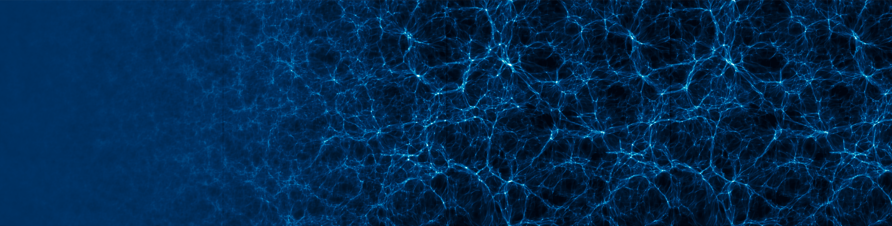
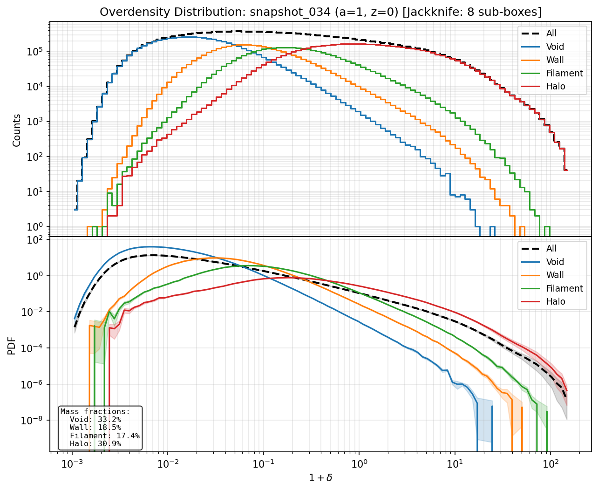

# tessera

[](https://github.com/beirving4/tessera/actions/workflows/ci.yml)
[](https://www.python.org)
[](https://opensource.org/licenses/MIT)

> **tes·ser·a** /ˈtesərə/ *noun*
>
> A small block of stone, tile, glass, or other material used in the construction of a mosaic. From Latin *tessera*, from Greek *tessares* "four" — referring to the four corners of the tiles used to tessellate a surface.

<p align="center">
  
  <br>
  <em>Time-series visualization of cosmic structure evolution (a=0.01 → a=100) generated with tessera</em>
</p>

<!-- <p align="center">
  
  <br>
  <em>Overdensity PDFs by ORIGAMI morphology class with jackknife uncertainty bands</em>
</p> -->

---

A high-performance C++ library with Python bindings for phase-space tessellation of cosmological N-body simulations. This is a modern rewrite of [gotetra](https://github.com/phil-mansfield/gotetra) with C++ as the computational core and Python as the primary interface.

## Overview

tessera computes density fields from N-body simulations using tetrahedron-based phase-space tessellation. Unlike traditional particle-mesh methods, this approach:

- **Handles stream crossing**: Properly resolves multi-stream regions where particle trajectories cross
- **Preserves phase-space structure**: Uses the Lagrangian-to-Eulerian mapping encoded in particle IDs
- **Provides sub-grid resolution**: Monte Carlo sampling within tetrahedra captures structure below the grid scale

The library also includes **ORIGAMI morphological classification** (Falck, Neyrinck & Szalay 2012) for identifying cosmic web structures (voids, walls, filaments, halos).

## Features

- **Tetrahedron-based density fields**: 3D volumes and 2D z-projections with Monte Carlo sampling
- **Subbox extraction**: Compute density in regions centered on halos or other structures
- **Physical space computation**: Option to compute density in physical (not comoving) coordinates
- **ORIGAMI classification**: Identify void/wall/filament/halo morphology per particle with linear regime detection
- **Unified pipeline**: Single-call API for morphology + density + grid deposition + PDF computation
- **Statistical analysis**: Histograms and PDFs with jackknife resampling for uncertainty estimation
- **Memory efficient**: In-place sorting supports N=1024³ simulations (~24GB positions)
- **Time-series visualization**: panoramic cosmic evolution images and animations
- **GADGET-4 I/O**: Read HDF5 snapshots (single or distributed) and FOF/Subfind catalogs
- **Merger tree support**: High-performance C++ reader for GADGET-4 merger trees with SIMD-optimized search
- **Multi-threaded**: Parallel computation with OpenMP
- **SPH density rendering**: SIMD-optimized SPH renderer as alternative to tessellation (no late-time artifacts)
- **Validated**: Tested against original gotetra with >0.999 correlation

## Installation

### Prerequisites

- CMake 3.15+
- C++17 compiler (GCC 8+, Clang 7+, MSVC 2019+)
- Python 3.10+ with NumPy
- HDF5 (optional, for GADGET-4 I/O)
- pybind11 (fetched automatically)

### Quick Install (pip)

The easiest way to install tessera is via pip:

```bash
git clone https://github.com/beirving4/tessera.git
cd tessera
pip install .
```

This will build the C++ extension and install it as a Python package. Verify the installation:

```bash
python -c "import tessera; print('Modules:', tessera.available_modules())"
```

### Building from Source (Development)

For development or if you need more control over the build:

```bash
git clone https://github.com/beirving4/tessera.git
cd tessera
mkdir build && cd build
cmake .. -DBUILD_PYTHON_BINDINGS=ON -DBUILD_WITH_HDF5=ON
make -j4
```

Then add the build directory to your Python path:

```bash
export PYTHONPATH=/path/to/tessera/build:$PYTHONPATH
python -c "import _tessera as ts; print('Modules:', [m for m in dir(ts) if not m.startswith('_')])"
```

## Quick Start

### Computing a 3D Density Field

```python
import numpy as np
import h5py
import _tessera as ts

# Load GADGET-4 snapshot
with h5py.File('snapshot_034.hdf5', 'r') as f:
    positions = np.ascontiguousarray(f['PartType1/Coordinates'][:], dtype=np.float64)
    particle_ids = np.ascontiguousarray(f['PartType1/ParticleIDs'][:], dtype=np.int64)
    box_size = float(f['Header'].attrs['BoxSize'])

# Determine grid size from particle count (assumes N^3 particles)
n_particles = len(positions)
grid_size = int(round(n_particles ** (1/3)))

# Sort particles by Lagrangian ID (required for tetrahedron construction)
sorted_positions = ts.density.sort_by_lagrangian_id(positions, particle_ids, grid_size)

# Configure density computation
config = ts.density.TetraDensityConfig()
config.lagrangian_grid_size = grid_size  # Particles per dimension
config.box_size = box_size
config.output_cells = 256                 # Output grid resolution
config.n_samples = 100                    # Monte Carlo samples per tetrahedron
config.n_threads = 4                      # OpenMP threads (0 = auto)
config.periodic = True                    # Periodic boundary conditions
config.particle_mass = 1.0                # Mass per particle

# Compute 3D density
result = ts.density.compute_tetra_density_3d(sorted_positions, config)
density_3d = np.array(result.density).reshape(256, 256, 256)
```

### Computing a 2D Projected Density

```python
# 2D z-projection (integrate along z-axis)
result_2d = ts.density.compute_tetra_density_2d_projection(sorted_positions, config, axis=2)
density_2d = np.array(result_2d.density).reshape(256, 256)
```

### Subbox Extraction (Halo-Centric Density)

```python
# Extract a 10 Mpc/h cube centered on a halo
config.subbox_enabled = True
config.subbox_origin = (halo_x - 5.0, halo_y - 5.0, halo_z - 5.0)
config.subbox_width = (10.0, 10.0, 10.0)
config.output_cells = 128

result = ts.density.compute_tetra_density_3d(sorted_positions, config)
```

### Artifact Mitigation (for a >> 1 simulations)

At late cosmological times (a > 10), tetrahedra become highly elongated as matter flows toward halos, causing radial streak artifacts. tessera provides four approaches to mitigate these:

```python
from tessera.utils import (
    gaussian_smooth_density,
    adaptive_smooth_density,
    compute_particle_density_sph,
    compute_density_auto,
    HybridDensityConfig
)

# Option 1: Gaussian smoothing (post-processing)
smoothed = gaussian_smooth_density(density, sigma=1.5)

# Option 2: Adaptive smoothing (stronger in low-count regions)
smoothed = adaptive_smooth_density(density, particle_counts, sigma_min=0.5, sigma_max=3.0)

# Option 3: C++ SPH renderer (15-30x faster than Python alternatives)
result = ts.density.render_sph_density_2d(
    positions,
    center=(halo_x, halo_y, halo_z),
    box_width=10.0,
    output_cells=256,
    sim_box_size=box_size,
    kernel=ts.density.SPHKernel.CUBIC_SPLINE
)

# Option 4: Automatic method selection (recommended)
config = HybridDensityConfig(
    tessellation_max_scale_factor=5.0,  # Use tessellation for a < 5
    sph_min_scale_factor=10.0,          # Use SPH for a > 10
    smoothing_sigma=1.5
)
result = compute_density_auto(positions, particle_ids, box_size, scale_factor=100.0, config=config)
print(f"Method used: {result['method']}")  # 'tessellation', 'tessellation_smoothed', or 'sph'
```

See [docs/artifact_mitigation.md](docs/artifact_mitigation.md) for detailed documentation.

### Physical Space Density (for a > 1 simulations)

For simulations run beyond a=1, you can compute density in physical coordinates while maintaining comoving grid extents:

```python
# Scale positions to physical coordinates
scale_factor = 100.0  # a=100
positions_physical = sorted_positions * scale_factor
box_physical = box_size * scale_factor

# Update config for physical box
config.box_size = box_physical
if config.subbox_enabled:
    config.subbox_origin = tuple(o * scale_factor for o in config.subbox_origin)
    config.subbox_width = tuple(w * scale_factor for w in config.subbox_width)

# Compute density in physical space
result = ts.density.compute_tetra_density_3d(positions_physical, config)
```

### ORIGAMI Morphology Classification

The unified ORIGAMI pipeline handles ID detection, Lagrangian sorting, morphology classification, density computation, and PDF analysis in a single efficient call:

```python
# Load unsorted positions and IDs directly from snapshot
with h5py.File('snapshot_034.hdf5', 'r') as f:
    positions = np.ascontiguousarray(f['PartType1/Coordinates'][:], dtype=np.float64)
    particle_ids = np.ascontiguousarray(f['PartType1/ParticleIDs'][:], dtype=np.int64)
    box_size = float(f['Header'].attrs['BoxSize'])

grid_size = int(round(len(positions) ** (1/3)))

# Configure the unified pipeline
config = ts.origami.PipelineConfig(grid_size, box_size)
config.density_output_cells = 256        # Compute density field at 256^3
config.sample_density_at_particles = True # Sample density at particle positions
config.grid_cells = 128                  # Deposit morphology to 128^3 grid
config.pdf_n_bins = 100                  # Compute overdensity PDFs
config.pdf_log_bins = True               # Use log-spaced bins
config.n_threads = 4                     # OpenMP threads (0 = auto)

# Run the complete pipeline (handles ID detection and sorting automatically)
result = ts.origami.run_pipeline(positions, particle_ids, config)

# Morphology results
print(f"Void:     {result.n_void:,} particles ({result.f_void:.1%})")
print(f"Wall:     {result.n_wall:,} particles ({result.f_wall:.1%})")
print(f"Filament: {result.n_filament:,} particles ({result.f_filament:.1%})")
print(f"Halo:     {result.n_halo:,} particles ({result.f_halo:.1%})")

# Check for linear regime (no shell-crossing yet)
if result.is_linear_regime:
    print("Warning: Field is in linear regime - ORIGAMI classification not meaningful")

# Access computed fields
morphology = np.array(result.morphology)           # Per-particle class (0-3)
particle_density = np.array(result.particle_density)  # Density at each particle
density_3d = np.array(result.density_3d).reshape(256, 256, 256)  # 3D field

# Volume fractions from grid deposition
print(f"Volume fractions: void={result.v_void:.1%}, halo={result.v_halo:.1%}")

# PDF results (histogram counts per morphology class)
hist_all = np.array(result.hist_all)
hist_halo = np.array(result.hist_halo)
bin_centers = np.array(result.pdf_bin_centers)
```

The pipeline is memory-efficient (supports N=1024³ simulations) and provides ~3x speedup over separate Python calls by avoiding redundant data copies.

For lower-level control, you can also use individual functions:

```python
# Sort particles manually (if needed)
sorted_positions = ts.density.sort_by_lagrangian_id(positions, particle_ids, grid_size)

# Compute morphology only
origami_config = ts.origami.OrigamiConfig(grid_size, box_size)
result = ts.origami.compute_morphology(sorted_positions, origami_config)

# Sample density at particle positions (after computing density_3d separately)
ts.origami.sample_density_at_particles(density_3d, sorted_positions, box_size, result)
```

## Examples

The `examples/` directory contains complete scripts demonstrating various use cases:

| Script | Description |
|--------|-------------|
| `basic_usage.py` | Core API: vectors, tetrahedra, random generators |
| `gadget4_io.py` | Reading GADGET-4 snapshots and halo catalogs |
| `tetra_density.py` | Reference implementation of density algorithm |
| `density_slice.py` | 2D density projections with visualization |
| `halo_density.py` | Halo-centric density extraction with tri-panel plots |
| `physical_space_demo.py` | Physical vs comoving coordinate density comparison |
| `origami_morphology.py` | Full ORIGAMI workflow with conditional PDFs |
| `overdensity_pdf_origami.py` | Overdensity distributions by morphological class (supports `--jackknife`) |
| `origami_slice_render.py` | 2D thin-slice visualization of ORIGAMI morphology |
| `origami_slice_animation.py` | Animated ORIGAMI morphology evolution |
| `density_method_comparison.py` | CIC vs DTFE vs VTFE density estimation comparison |
| `power_spectrum_analysis.py` | P(k) computation, GADGET-4 comparison, Fourier smoothing, σ_R² cross-check |
| `pdf_resolution_comparison.py` | CIC PDF resolution dependence across grid sizes |
| `time_series_origami.py` | ORIGAMI time-series with density-blended coloring |
| `time_series_pipeline.py` | Complete panoramic time-series visualization |
| `generate_projections.py` | Generate 2D density projections from snapshots |
| `build_time_series.py` | Build static time-series image (x=time, y=space) |
| `animate_evolution.py` | Create evolution animation with callout annotations |

Run an example:
```bash
python examples/origami_morphology.py snapshot_034.hdf5 -o origami.h5 --plot origami.png
```

### Time-Series Visualization

Create cosmic evolution visualizations where the x-axis represents cosmic time:

```bash
# Full pipeline: projections → static image → animation
python examples/time_series_pipeline.py \
    --snapshot-dir /path/to/snapshots \
    --output-dir ./output \
    --n-threads 4

# Or run steps individually:
python examples/generate_projections.py --snapshot-dir /path/to/snapshots --output-dir ./output
python examples/build_time_series.py --projections ./output/density_projections.h5 --output time_series.png
python examples/animate_evolution.py --projections ./output/density_projections.h5 --output evolution.mp4
```

The animation script supports callout annotations for labeling cosmic events—edit `CALLOUT_TEMPLATE` in `animate_evolution.py` to add custom annotations.

## Modules

### `ts.density` - Density Field Computation

**Tetrahedron-based (phase-space tessellation):**
- `TetraDensityConfig`: Configuration for tessellation density
- `compute_tetra_density_3d()`: Full 3D density field
- `compute_tetra_density_2d_projection()`: 2D projection along an axis
- `sort_by_lagrangian_id()`: Sort particles to Lagrangian grid order

**SPH-based (no tessellation artifacts):**
- `SPHConfig`: Configuration for SPH rendering
- `SPHRenderer`: High-performance SPH renderer class
- `render_sph_density_2d()`: 2D SPH density projection (convenience function)
- `SPHKernel`: Kernel types (CUBIC_SPLINE, WENDLAND_C2, WENDLAND_C4, QUINTIC_SPLINE)
- `SPHParticles`: Structure-of-arrays particle container
- `estimate_smoothing_length()`: Estimate h from particle density

### `ts.origami` - Morphological Classification

**Unified Pipeline (recommended):**
- `PipelineConfig`: Configuration for the complete ORIGAMI pipeline
- `run_pipeline()`: All-in-one: ID detection, sorting, morphology, density, grid, PDFs
- `run_pipeline_safe()`: Same as above but preserves input arrays (makes copies)

**Individual Functions:**
- `OrigamiConfig`: Configuration for standalone ORIGAMI morphology
- `compute_morphology()`: Classify particles as void/wall/filament/halo
- `sample_density_at_particles()`: Interpolate density grid at particle positions
- `deposit_morphology_to_grid()`: Create grid-based morphology fields

**Result Objects:**
- `PipelineResult`: Complete output from unified pipeline (morphology, density, PDFs)
- `OrigamiResult`: Output from standalone morphology computation
- `is_linear_regime`: Flag indicating pre-shell-crossing state (f_void > 99%)

### `ts.stats` - Statistical Analysis

- `histogram()`: Linearly-binned histogram
- `histogram_log()`: Logarithmically-binned histogram
- `histogram_to_pdf()`: Convert histogram counts to probability density
- `bin_centers()`: Compute bin centers from edges
- `compute_jackknife_histogram()`: Histogram with jackknife uncertainty estimation
- `compute_jackknife_conditional_histogram()`: Per-ORIGAMI-class histograms with uncertainties

### `ts.io` - File I/O

**Snapshot I/O:**
- `read_gadget4_header()`: Read GADGET-4 HDF5 header
- `read_gadget4_positions()`: Read particle coordinates
- `read_gadget4_velocities()`: Read particle velocities
- `read_fof_catalog()`: Read Friends-of-Friends group catalog
- `read_subfind_catalog()`: Read Subfind subhalo catalog

**Merger Tree I/O:**
- `MergerTree`: High-performance reader for GADGET-4 merger tree HDF5 files
  - Lazy loading with staged data access (search data loaded first for fast lookups)
  - SIMD-optimized halo search (AVX2: 8x parallel comparison)
  - ~36x faster first lookup compared to loading all data upfront
- `HaloTracker`: Branch tracing through merger trees
  - `trace_main_branch()`: Follow main progenitor/descendant chain
  - `trace_from_tree_id()`: Trace from a specific tree's root halo
  - `trace_all_progenitors()`: BFS traversal of all progenitor branches
  - `unwrap_coordinates()`: Handle periodic boundary crossings for smooth tracking
- `HaloInfo`: Halo data struct (position, velocity, mass, M200c, R200c, etc.)
- `read_merger_tree_header()`: Read header only (fast metadata access)

### `ts.geom` - Geometry Primitives

- `Vec3f`, `Vec3d`: 3D vectors with periodic operations
- `Tetra`: Tetrahedron with volume, containment, Monte Carlo sampling
- `CellBounds`: Axis-aligned bounding boxes

### `ts.math` - Random Number Generation

- `Generator`: High-quality RNG (Tausworthe, Xorshift, Mersenne Twister)
- Efficient batch generation for Monte Carlo sampling

### `ts.cosmo` - Cosmology

- `critical_density()`: Critical density at redshift z
- `average_density()`: Mean matter density

## Python Modules

### `tessera.visualize` - Visualization Utilities

Reusable matplotlib-based visualization functions with Python 3.10+ type hints:

```python
from tessera.visualize import plot_density_slice, plot_morphology_slice, create_density_validation_figure
```

**Core utilities (`visualize.core`):**
- `setup_matplotlib_backend()`: Configure matplotlib for non-interactive rendering
- `setup_publication_style()`: Set rcParams for publication-quality figures
- `add_colorbar()`: Add colorbar using make_axes_locatable pattern
- `percentile_clim()`: Compute percentile-based color limits
- `save_figure()`: Save figure with standard settings

**Density visualization (`visualize.density`):**
- `plot_density_slice()`: 2D density slice with log scaling and colorbar
- `plot_density_comparison()`: Side-by-side density comparison panels

**Morphology visualization (`visualize.morphology`):**
- `MORPHOLOGY_COLORS`, `MORPHOLOGY_NAMES`: Standard colors/names for void/wall/filament/halo
- `create_morphology_cmap()`: Discrete colormap for ORIGAMI classes
- `plot_morphology_slice()`: 2D slice of morphology grid
- `plot_morphology_slices_3panel()`: XY/XZ/YZ tri-panel morphology view
- `plot_morphology_fractions_pie()`: Pie chart of mass/volume fractions
- `plot_morphology_comparison_bar()`: Grouped bar chart comparing classifications

**Validation figures (`visualize.comparison`):**
- `create_density_validation_figure()`: 2x3 panel density comparison (maps + statistics)
- `create_origami_validation_figure()`: 1x3 ORIGAMI validation (pies + bar chart)

**PDF/histogram plotting (`visualize.pdf`):**
- `plot_pdf_histogram()`: Single PDF with log scaling
- `plot_pdf_comparison()`: Overlaid PDFs for comparison
- `plot_pdf_with_fit()`: PDF with power-law fit in high-density tail

### `tessera.utils` - Shared Utilities

Helper functions for example and test scripts with Python 3.10+ type hints:

```python
from tessera.utils import load_snapshot, sort_positions_lagrangian, infer_grid_size
```

**Snapshot loading:**
- `load_snapshot()`: Load GADGET-4 snapshot using tessera C++ reader
- `load_snapshot_h5py()`: Fallback loader using h5py directly
- `infer_snapshot_number()`: Extract snapshot number from filename

**Halo catalogs:**
- `find_halo_catalog()`: Find associated fof_subhalo_tab file
- `load_halo_catalog()`: Load GADGET-4 halo catalog

**Lagrangian sorting:**
- `sort_positions_lagrangian()`: Sort particles to Lagrangian order
- `infer_grid_size()`: Infer grid size from particle count

**Density utilities:**
- `extract_2d_slice()`: Extract 2D slice from 3D density field
- `save_density_hdf5()`: Save density field to HDF5 with metadata
- `compute_mean_density()`: Compute mean 3D density
- `compute_mean_surface_density()`: Compute mean surface density for slice

**Artifact mitigation:**
- `gaussian_smooth_density()`: Gaussian smoothing for artifact reduction
- `adaptive_smooth_density()`: Count-weighted adaptive smoothing
- `compute_particle_density_sph()`: SPH-style kernel density estimation
- `compute_particle_density_cic()`: Cloud-in-Cell density assignment
- `compute_density_auto()`: Auto-select method based on scale factor
- `HybridDensityConfig`: Configuration for hybrid density computation

**Fourier-space operations:**
- `smooth_field_fourier()`: FFT-based smoothing of 3D periodic grids (Gaussian or top-hat)
- `compute_power_spectrum()`: Spherically-averaged P(k) with CIC deconvolution and shot noise subtraction
- `sigma_R_squared_from_pk()`: Variance σ_R² from P(k) integration with effective window
- `sigma_R_squared_from_field()`: Direct field variance measurement
- `recommend_cic_config()`: Auto-select CIC grid resolution based on Klypin et al. (2018) constraints
- `gaussian_window()`, `tophat_window()`: Fourier-space window functions

**GADGET-4 power spectrum reader:**
- `read_gadget4_powerspec()`: Parse and stitch folded GADGET-4 `powerspec_NNN.txt` files
- `read_gadget4_colossus_pk()`: Read 2-column `for_colossus_NNN.txt` log-space format
- `get_powerspec_paths()`: Find all power spectrum files in a directory

**Halo evolution (re-exports from `ts.io`):**
- `MergerTree`: C++ merger tree reader (high-performance, lazy loading)
- `HaloTracker`: Branch tracing with prefetching
- `HaloInfo`: Halo information struct
- `DensityRenderer`: Convenience wrapper for halo-centric density rendering

## Algorithm

The density computation follows the gotetra algorithm:

1. **Lagrangian Grid**: Particles are indexed by their initial grid positions (encoded in particle IDs)
2. **Tetrahedron Decomposition**: Each Lagrangian cell is split into 6 tetrahedra
3. **Monte Carlo Sampling**: Random points within each tetrahedron deposit mass onto the Eulerian grid
4. **Stream Crossing**: Multi-stream regions are naturally handled as tetrahedra can overlap

The ORIGAMI algorithm detects shell-crossing by checking for sign reversals in particle ordering along Cartesian and diagonal directions.

## Validation

### Density Field Validation

The density computation has been validated against the original gotetra implementation:

| Test Case | Correlation | Mean Relative Diff |
|-----------|-------------|-------------------|
| Full box (a=1) | 0.99999 | 0.35% |
| Full box (a=100) | 0.99999 | 0.40% |
| Halo subbox (a=1) | 0.99990 | 16.8% |
| Halo subbox (a=100) | 0.99999 | 0.15% |

See `tests/gotetra_validation/` for validation scripts and results.

### ORIGAMI Validation

The ORIGAMI morphology classification achieves 100% exact match with the original algorithm:

| Snapshot | Match Rate | tessera Speedup |
|----------|------------|-----------------|
| a=1 (z=0) | 100.0000% | 1.15x |
| a=100 (z=-0.99) | 100.0000% | 1.15x |

See `tests/origami_validation/` for validation scripts and results.

## References

- **gotetra**: Mansfield, P. - [github.com/phil-mansfield/gotetra](https://github.com/phil-mansfield/gotetra)
- **ORIGAMI**: Falck, B., Neyrinck, M. C., & Szalay, A. S. 2012, ApJ, 754, 126
- **Phase-space tessellation**: Abel, T., Hahn, O., & Kaehler, R. 2012, MNRAS, 427, 61 - [Tracing the dark matter sheet in phase space](https://academic.oup.com/mnras/article/427/1/61/1032914)
- **Visualization**: Kaehler, R., Hahn, O., & Abel, T. 2012, IEEE TVCG, 18, 2078 - [A Novel Approach to Visualizing Dark Matter Simulations](https://ieeexplore.ieee.org/document/6327223)
- **Sheet simulation**: Hahn, O., Abel, T., & Kaehler, R. 2013, MNRAS, 434, 1171 - [A new approach to simulating collisionless dark matter fluids](https://academic.oup.com/mnras/article/434/2/1171/1064908)
- **Density PDF**: Klypin, A., Prada, F., Betancort-Rijo, J., & Albareti, F.D. 2018, MNRAS, 481, 4588 - [Density distribution of the cosmological matter field](https://academic.oup.com/mnras/article/481/4/4588/5107359)

## License

MIT License - see LICENSE file for details.

## Citation

If you use this software in your research, please cite:

```bibtex
@software{tessera,
  author = {Irving, Bryen and Mansfield, Phil},
  title = {tessera: Phase-space tessellation for cosmological simulations},
  url = {https://github.com/beirving4/tessera},
  note = {Based on gotetra by Phil Mansfield}
}
```
